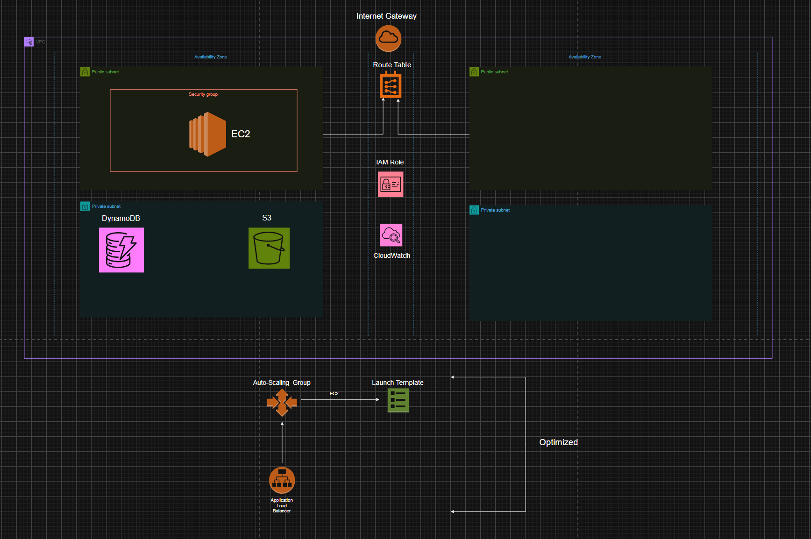
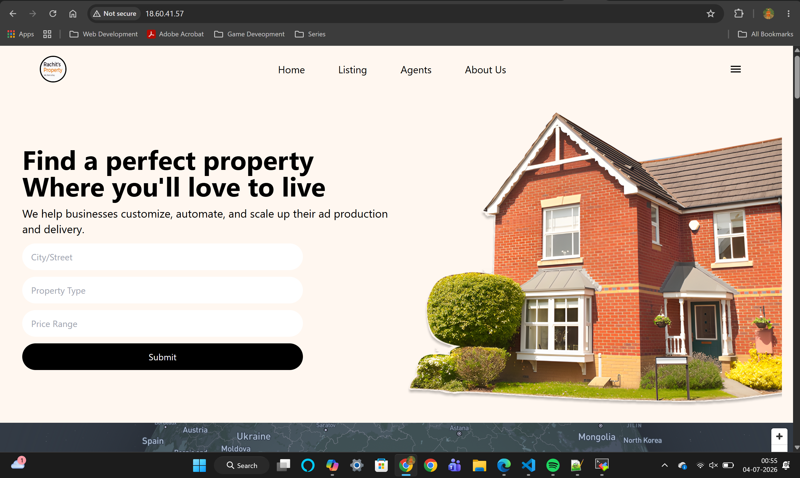
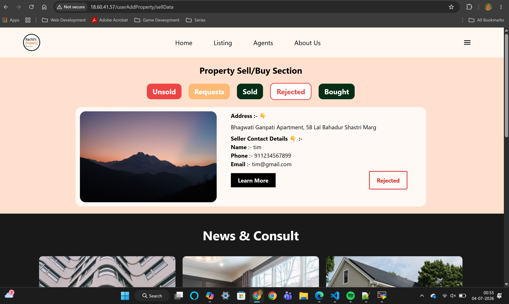
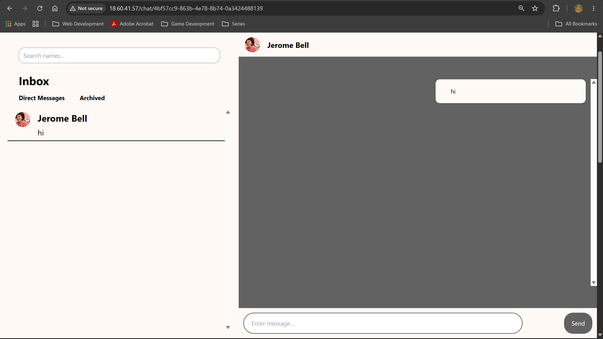
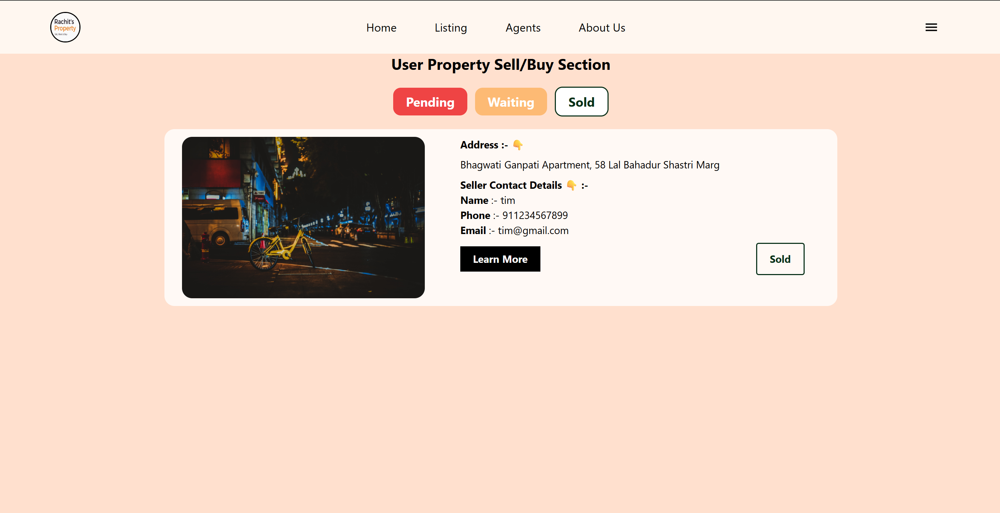
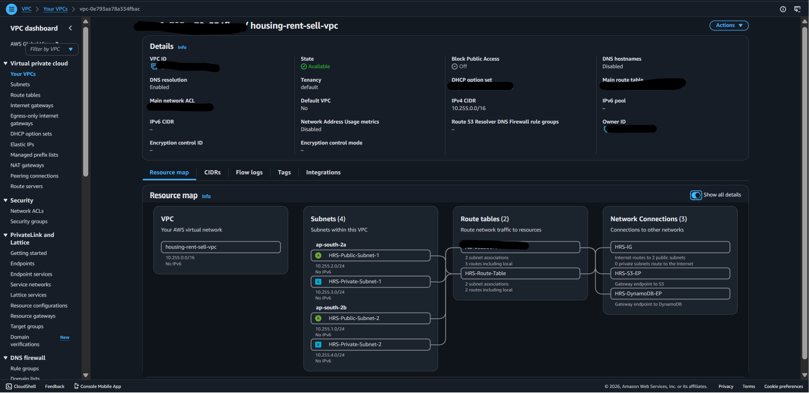
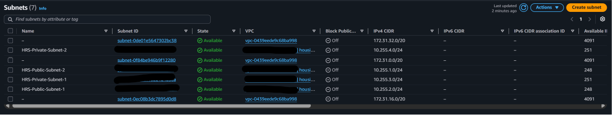
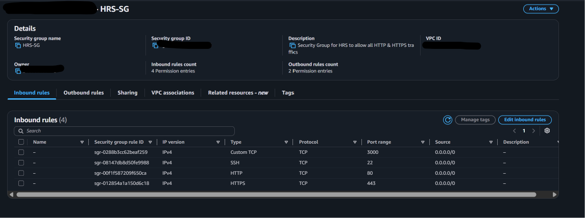

Hi All,

Welcome to Housing Rent Sell AWS Project. This project uses various AWS services which helps this application in deployement, extracting images from datastorage like AWS S3 Bucket and retrieving data from Non-relational database like AWS DynamoDB.

You are free to play with this project. 
Things to consider :
1. Team Member Login : Creds for logining as Team Member are placed in Server/Helpers/teams.js
2. You need to deploy this application in your AWS account. Consider this as a learning apportunity, if u are only looking to practice on AWS, rather investing time in creating an apllication.
3. Plaese follow the AWS Diagram and to help u understand what all AWS Services are used as part of this project.
4. There might be some bugs but again, I tried my best to make it usable to get hands on, on AWS Services. in your 

AWS Services Used for Deployment, Optimization and Monitoring

I have attached some application screen shots, though might be helpful.

Deploy on AWS.

Common things to consider :
1. Create an IAM Policy for your application with s3 and dynamoDB access.

2. Create VPC (Virtual Private Cloud).

3. Create Subnets in your VPC. Try with 2 AZs (Private & Public)

4. Create S3 with bucket name. (Make it secured not public using IAM Role and Name).
5. Create a DynamoDB instance.
6. In VPC, create a Internet Gateway and attach it to VPC.
7. Create a Routing Table and attach a route from internet gateway to public Subnets.
8. Create a DynamoDB and S3 endpoints in VPC to attch them to private Subnets.
9. Create a Security Group with inbounds rules for HTTP, HTTPS, SSH, TCP (Port: 3000). Outbound rules allows HTTP and HTTPS.

Method - 1 : Deploying on a single EC2 Instance.

1. Create EC2 Instance and enter instance name.
2. AMI : Amazon Linux
3. Instance Family  : t3.small (2 GPU Memory)
4. Network : VPC -> Your VPC.
5. Security Group -> Your SG.
6. Subnet : Public one.
7.  Advanced Settings: Instance Profile : IAM Role which u created.
8. User data: Copy & Paste the userdata from script.sh inside user data folder.
9. Replace some configuration with your Services like s3 bucket name, region, etc.
10. Deploy and use Public IP to access instance.

Method - 2 : Auto-Scaling and Optimisation

1. Create a Launch Template. Same user data script
2. Create auto-scaling group.
3. Create Application Load Balancer with target group. Listener : HTTP on Port 80.
4. Access the Load Balancer DNS to access the application.

Enjoy !!

Thank you,
Rachit